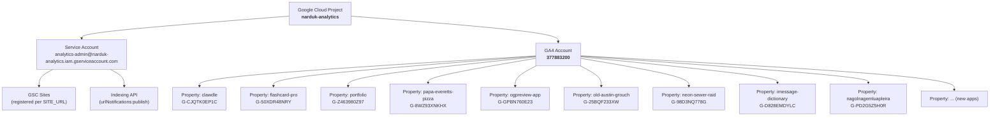
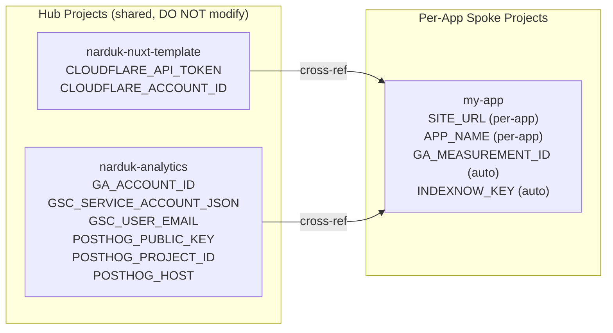
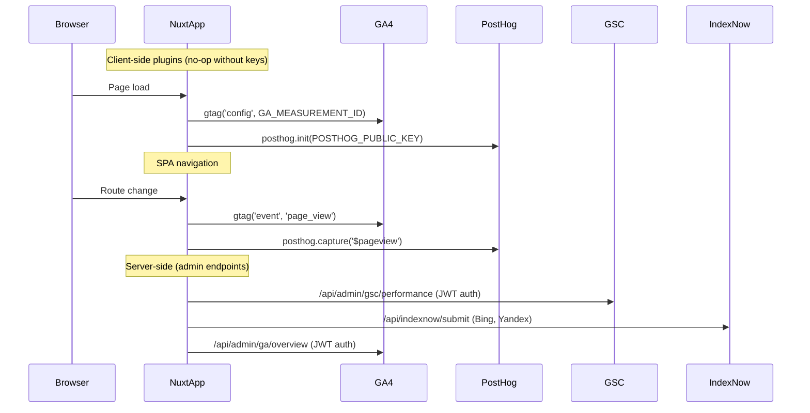

# Analytics Architecture Reference

> **Location:** `.agents/app-standardization/analytics-architecture.md`
>
> Everything an agent needs to know to set up, audit, or troubleshoot analytics
> across any Narduk app.

---

## Entity Hierarchy

## Doppler Architecture

## Shared Identifiers (narduk-analytics project)

| Entity                | Value                                                      |
| --------------------- | ---------------------------------------------------------- |
| GCP Project ID        | `narduk-analytics`                                         |
| Service Account Email | `analytics-admin@narduk-analytics.iam.gserviceaccount.com` |
| GA4 Account ID        | `377883200`                                                |
| GSC User Email        | `narduk@gmail.com`                                         |
| PostHog Public Key    | `phc_89fp2sDs0E8GTO5BAGoMTz1MkZbJ5BuCcR4fryqcuAF`          |
| PostHog Project ID    | `325202`                                                   |
| PostHog Host          | `https://us.i.posthog.com`                                 |

## Per-App Measurement IDs

| App                          | GA4 Measurement ID | Production URL                                   | IndexNow |
| ---------------------------- | ------------------ | ------------------------------------------------ | -------- |
| clawdle                      | `G-CJQTK0EP1C`     | `https://clawdle.com`                            | ✅       |
| flashcard-pro                | `G-50XDR48NRY`     | `https://flashcard-pro.narduk.workers.dev`       | ✅       |
| narduk-enterprises-portfolio | `G-Z463980Z97`     | `https://portfolio.nard.uk`                      | ✅       |
| papa-everetts-pizza          | `G-8WZ93XNKHX`     | `https://papaeverettspizza.com`                  | ✅       |
| ogpreview-app                | `G-GPBN760E23`     | `https://ogpreview.app`                          | ✅       |
| old-austin-grouch            | `G-25BQF233XW`     | `https://grouch.austin-texas.net`                | ✅       |
| neon-sewer-raid              | `G-98D3NQ778G`     | `https://neon-sewer-raid.narduk.workers.dev`     | ❌       |
| imessage-dictionary          | `G-D828EMDYLC`     | `https://dictionary.nard.uk`                     | ❌       |
| nagolnagemluapleira          | `G-PD2G5Z5H0R`     | `https://nagolnagemluapleira.narduk.workers.dev` | ❌       |

## Integration Flow (Runtime)

## Key Files

| File                                   | Purpose                                           |
| -------------------------------------- | ------------------------------------------------- |
| `layers/.../plugins/gtag.client.ts`    | GA4 page tracking (reads `GA_MEASUREMENT_ID`)     |
| `layers/.../plugins/posthog.client.ts` | PostHog analytics (reads `POSTHOG_PUBLIC_KEY`)    |
| `layers/.../server/utils/google.ts`    | Service account JWT auth for GA/GSC/Indexing APIs |
| `tools/setup-analytics.ts`             | Bootstrap: PostHog → GA4 → GSC → IndexNow         |
| `tools/gsc-toolbox.ts`                 | CLI for GSC site management + Indexing API        |

## Troubleshooting

| Symptom                    | Cause                              | Fix                                                                                                 |
| -------------------------- | ---------------------------------- | --------------------------------------------------------------------------------------------------- |
| GA4 not tracking           | `GA_MEASUREMENT_ID` empty or wrong | Check Doppler: `doppler secrets get GA_MEASUREMENT_ID --project APP --config prd`                   |
| PostHog not tracking       | `POSTHOG_PUBLIC_KEY` empty         | Wire hub ref: `doppler secrets set 'POSTHOG_PUBLIC_KEY=${narduk-analytics.prd.POSTHOG_PUBLIC_KEY}'` |
| GSC API 403                | Service account not authorized     | Add `analytics-admin@narduk-analytics.iam.gserviceaccount.com` as owner in GSC                      |
| IndexNow 400               | Key file not served                | Check `INDEXNOW_KEY` is set and `/api/indexnow/submit` exists                                       |
| `setup-analytics.ts` fails | Missing `GA_ACCOUNT_ID`            | Wire hub ref from `narduk-analytics`                                                                |
